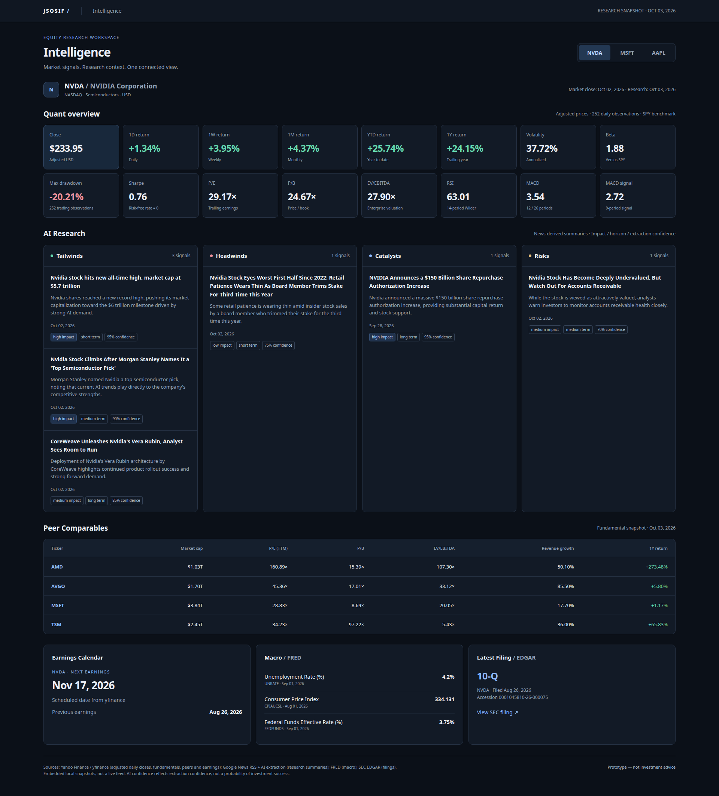

# jsosif-ai-pipeline-demo

A multi-ticker demo of a dual-pipeline investment intelligence setup: **quant metrics + AI research**, merged into one report.

Built for [JSOSIF](https://www.uwindsor.ca) (John Simpson Odette Student Investment Fund) dev team discussion. This is a prototype to validate the architecture, not a production system.

## How it works

```
Market APIs (yfinance) ──→ Python metrics ──┐
                                            ├─→ {TICKER}-intelligence-*.md
News RSS ──→ Gemini extract / classify ─────┘
```

- **Quant**: 1D/1W/1M/YTD/1Y returns, annualized volatility, beta vs SPY, max drawdown, Sharpe, P/E, P/B, EV/EBITDA, revenue growth, MA50/MA200, RSI(14), MACD. Cross-checked against raw CSV with independent recomputation.
- **AI research**: Google News RSS (25 headlines) → Gemini structured extraction into tailwinds / headwinds / catalysts / risks, each with an English summary, date, impact, horizon, and confidence. The report matches headlines to RSS source URLs.
- **Free sources only**: yfinance, Google News RSS, SEC EDGAR, FRED (optional key). No paid APIs.

## Repo contents

| File | What |
|---|---|
| `INDEX.md` | Links and summaries for NVDA, MSFT, AAPL, GOOGL, AMZN and TSLA (start here) |
| `quant.py` | Market data + metrics → `{ticker}-quant.json` |
| `ai_extract.py` | RSS fetch + Gemini extraction → `{ticker}-ai-intel.json` |
| `comparables.py` / `earnings.py` / `fred.py` / `edgar.py` | Peer comps, earnings calendar, macro (FRED), latest SEC filing |
| `regenerate_report.py` | Assembles the Markdown report |

## Six-asset dashboard

Open [`index.html`](index.html) in a browser for the six-asset dashboard covering NVDA, MSFT, AAPL, GOOGL, AMZN and TSLA. The page uses an embedded data snapshot. Rerunning the pipeline does not automatically refresh it; regenerate or update the embedded snapshot in `index.html` to see new data on the dashboard.

## Intelligence page prototype

A static mockup of the future dashboard Intelligence page (open `intelligence-mockup.html` in a browser). The mockup currently shows NVDA, MSFT and AAPL; all six ticker reports are available in `INDEX.md`.



## Run it

```bash
python3 -m pip install pandas numpy yfinance
python3 fred.py  # once, or reuse the existing fred.json snapshot
for ticker in NVDA MSFT AAPL GOOGL AMZN TSLA; do
    python3 quant.py --ticker "$ticker"
    python3 ai_extract.py --ticker "$ticker"
    python3 comparables.py --ticker "$ticker"
    python3 earnings.py --ticker "$ticker"
    python3 edgar.py --ticker "$ticker"
    python3 regenerate_report.py --ticker "$ticker"
done
```

All six ticker scripts default to NVDA when `--ticker` is omitted. Outputs are written beside the scripts: lowercase ticker JSON files (for example `msft-quant.json`) and uppercase report names (`MSFT-intelligence-20261003.md`). Shared macro data stays in `fred.json`. AI calls are spaced at least 20 seconds apart; failed requests retry once after 90 seconds, then the AI sections show N/A. `run_phase1.py` runs all six tickers in sequence using the existing FRED snapshot.

The scripts use the shared `data_utils.py` helper. AI extraction requires the Gemini CLI configured at the absolute `CLI` path in `ai_extract.py`; set `GEMINI_CLI` to override it for your environment. Report generation reuses local JSON snapshots and does not fetch data.

## Limitations

- Supports NVDA, MSFT, AAPL, GOOGL, AMZN and TSLA; report date is fixed to this demo snapshot (2026-10-03).
- Free-tier data: delayed quotes, RSS coverage not guaranteed, AI items need human review.
- Free-tier Gemini grounding (`google_search` tool) returned 429 in the original run — the demo works around it with RSS + plain-text extraction.
- Not investment advice.

## Status

Prototype for architecture discussion. If the team agrees on the direction, this gets rebuilt properly with a real intelligence database and broader asset coverage.
